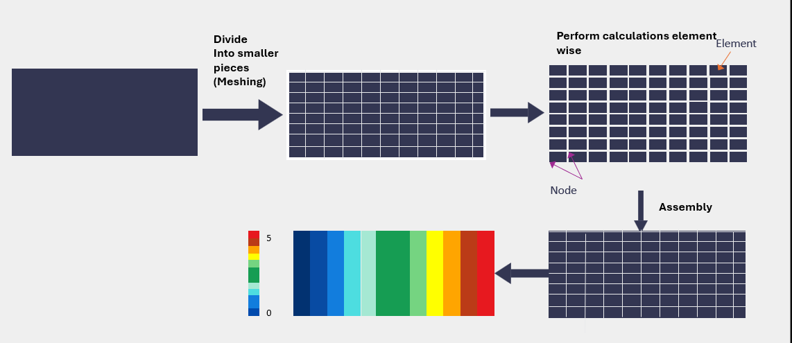
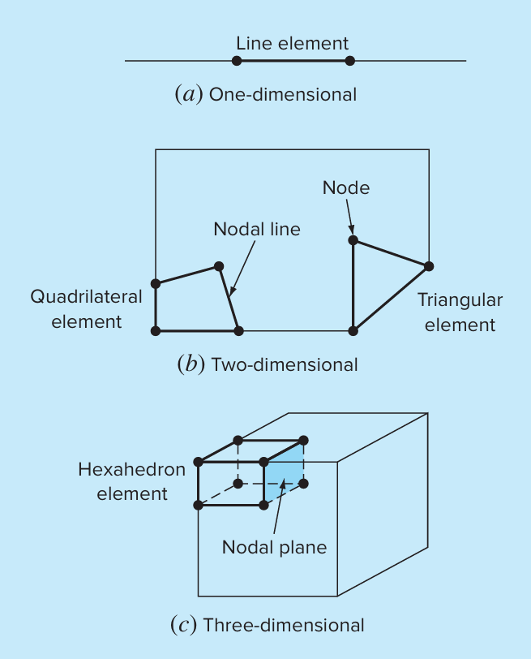
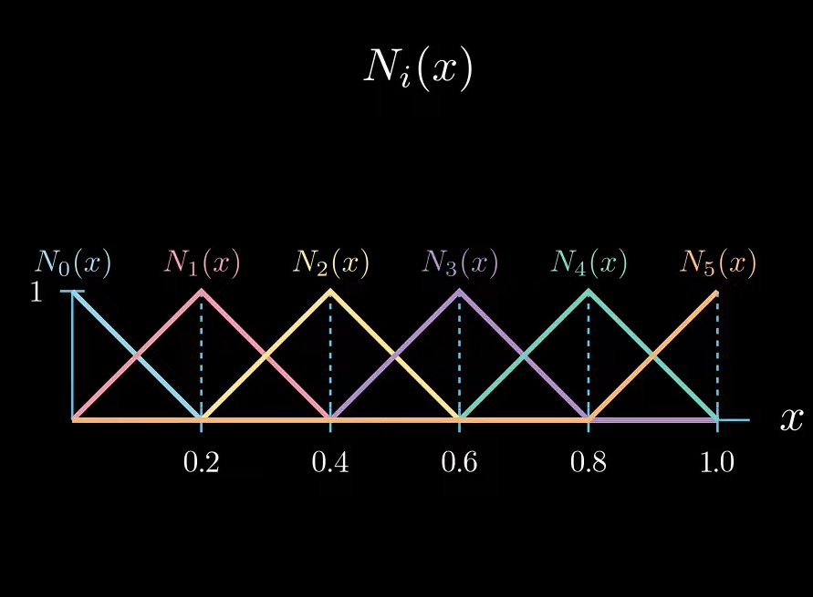

# What is the Finite Element Method?

The Finite Element Method (FEM) is a numerical technique used to approximate solutions of partial differential equations (PDEs). Instead of solving the PDE over the entire domain directly, FEM begins by performing Discretization —dividing the domain into smaller, manageable sub-regions known as finite elements. Within each element, the unknown solution is approximated using shape functions selected to represent the local behavior of the solution. The shape function can be in 1-D (e.g., bars), 2-D (e.g., triangles or squares), or 3-D (e.g., cubes).

To formulate the problem for numerical computation, the governing equations are transformed from their strong form to a weak formulation. This derivation leads to the construction of element-level matrices, which are then assembled into global system matrices—specifically, the stiffness matrix (K) and, for time-dependent problems, the mass matrix (M).

The final result is a system of linear equations representing the behavior of the entire domain. Solving this system yields numerical values at the nodes, which are then used with the shape functions to reconstruct an approximation of the original PDE solution across the domain. For transient problems, numerical time-stepping methods such as the Implicit Euler Method are employed to solve the system iteratively over time. Through this systematic approach, FEM provides a versatile and robust framework for solving complex engineering and physical problems.

$u(x)=\boxed{\sum_{i=0}^N {N_i(x) u_i(x)}}$

 Where :
 - u(x) is the approximated solution
 - $u_i(x)$ is the obtained parameters from system of equations
 - $N_i(x)$ is the shape function for each respective node

<figure style="display: flex; flex-direction: column; align-items: center; text-align: center;">
    
    <figcaption>Steps of FEM</figcaption>
  </figure>

---
# Discretization

 This step involves dividing the solution domain into finite elements. Figure 1.1 provides examples of elements employed in one, two, and three dimensions.
 The points of intersection of the lines that make up the sides of the elements are referred to as nodes and the sides themselves are called nodal lines or planes each cohsen   for the desired level of accuracy.

 
 For instance, linear shape functions are often used for basic elements, where the solution is assumed to vary linearly between nodes, while quadratic or higher-order shape functions can capture more complex variations. The shape functions are constructed to satisfy the interpolation condition each function is equal to 1 at its corresponding node and 0 at all other nodes in the element as shown in figure 1.2 . For example in figure 1.2, $N_1(x)$ is a piecewise function that represents 1 at node 1 and 0 at all other nodes. This ensures that the approximate solution is built directly from the nodal values. In a 1-D linear element, for example, the solution is expressed as a weighted combination of two shape functions, each associated with one of the two nodes. By selecting and combining these shape functions across the entire mesh, FEM provides an efficient way to approximate solutions to complex physical problems.
 

  <figure style="display: flex; flex-direction: column; align-items: center; text-align: center;">
    
    <figcaption>Figure 1.1: Example of elemnts</figcaption>
  </figure>

  <figure style="display: flex; flex-direction: column; align-items: center; text-align: center;">
    
    <figcaption>Figure 1.2: Shape function representation</figcaption>
  </figure>

# Derivation to Weak formulation

The **weak formulation** in the Finite Element Method is a reformulation of a differential equation that makes it easier to solve numerically. Instead of requiring the equation to hold exactly at every point (as in the strong form), the weak form requires it to hold in an averaged sense by integrating it against a test function. This reduces the order of derivatives and allows for approximations using simpler functions, making the problem suitable for FEM.
For example : if we have a following differential equation $u \prime \prime (x)=f(x)$ we can simply get its weak form by multiplying by test function in both sides and integrating over the domain. 
After it you apply partial intergration rule and you reach weak form $\int_{x_1}^{x_2} u\prime (x) v\prime (x) dx=-\int_{x_1}^{x_2} f(x)v(x) dx$

# Derivation of Stiffness matrix K and mass Matrix M

the resulting element equations will often consist of a set of linear algebraic equations that can be expressed in matrix form
 [k]{u}={F}

 where :
 
 - [k] = an element property, or stiffness, matrix
 - {u} = a column vector of unknowns at the nodes
 - {F} = a column vector reflecting the effect of any external influences applied at the nodes.

   Solved the systen using the LU Decomposition
